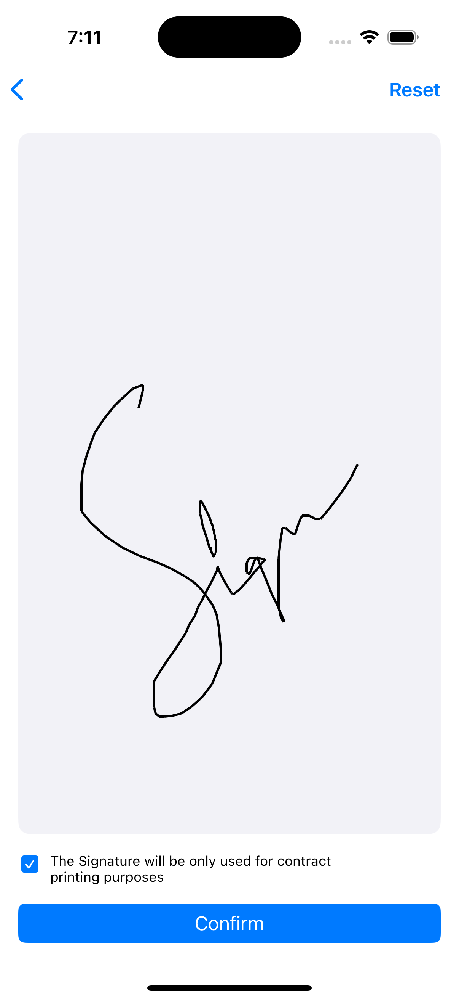

# Digital Signature App

Welcome to the Digital Signature App! This application allows you to sign your name or any other content directly on a canvas, view your signature, edit it, reset it, and save it for future use. It's designed to be simple, intuitive, and user-friendly for anyone needing to sign documents or create digital signatures.

## Features

- **Draw on Canvas**: Use your mouse, stylus, or touchscreen to draw a signature on a canvas.
- **View Signature**: Preview your signature as you draw.
- **Edit Signature**: Make changes to your signature at any time.
- **Reset Canvas**: Clear the canvas and start a new signature.
- **Save Signature**: Save your signature as an image (e.g., PNG, JPG) for later use.

---
### Screenshot

## Usage

### Drawing a Signature
1. Once the app is loaded, you will see a blank canvas.
2. Use your mouse, stylus, or touchscreen to draw your signature directly on the canvas.
3. The app will immediately display your drawing in real-time.

### Resetting the Canvas
1. To clear the canvas and start over, click the "Reset" button located at the top of the page.
2. This will erase your current signature and provide you with a clean slate.

### Saving the Signature
- After you're satisfied with your signature, click the checkbox and Confirm button.

Here's an example of what the app looks like:

---

Thank you for using the Digital Signature App! I hope it helps streamline your document signing process.
